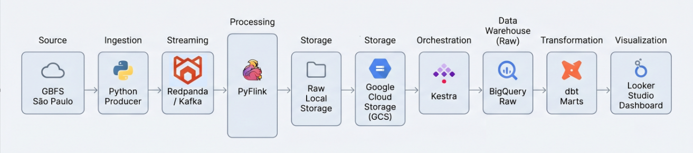
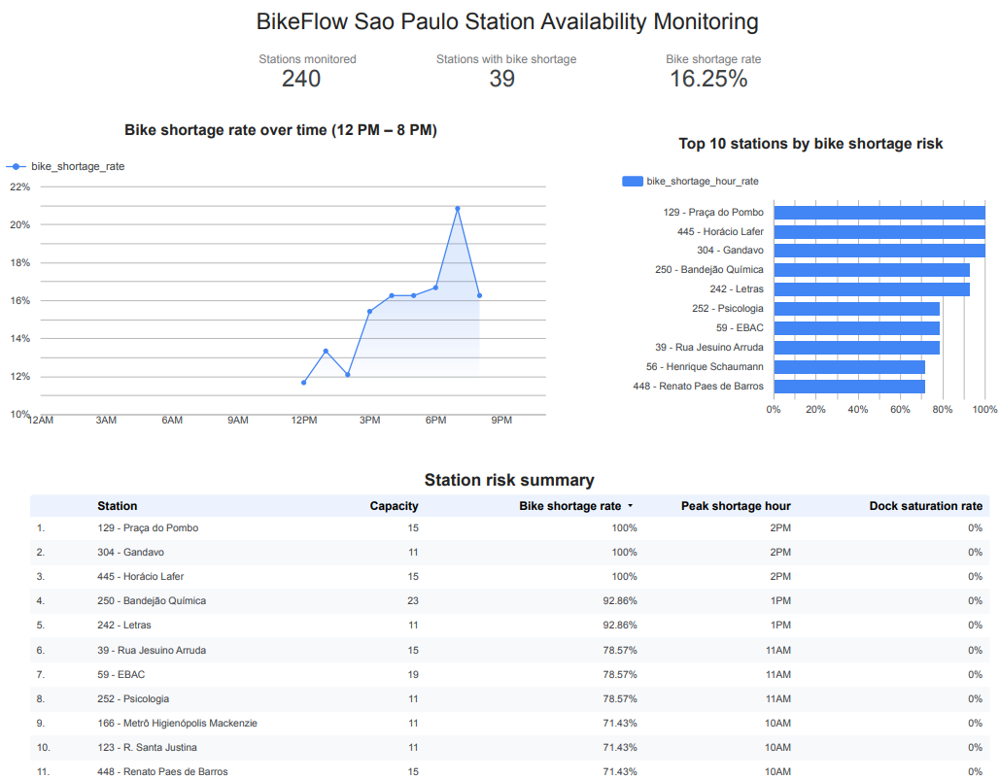

# BikeFlow SP End-to-End

End-to-end data engineering project for near-real-time bike station monitoring in São Paulo using GBFS, Redpanda, PyFlink, GCS, BigQuery, dbt, Kestra, and Looker Studio.

## Problem statement

Bike-sharing systems depend on balanced station availability. If a station runs out of bikes, users cannot start trips. If it runs out of docks, users cannot end them.

This project monitors station-level bike and dock availability in São Paulo to identify shortage, saturation, and operational imbalance patterns over time.

The goal is to build an end-to-end streaming data pipeline that ingests GBFS data, stores it in a data lake, loads it into a data warehouse, transforms it for analytics, and exposes the final results in a dashboard.

## Why this project

Urban bike-sharing systems generate near-real-time station status updates that can be used to answer operational questions such as:

* Which stations frequently run out of bikes?
* Which stations frequently run out of docks?
* How does availability change throughout the day?
* Which stations show stronger shortage or saturation risk?

This makes the project a strong real-world case for streaming ingestion, event processing, cloud storage, analytics engineering, orchestration, and dashboarding.

## Dataset

Source: GBFS feed for the São Paulo bike-sharing system.

Main feeds used:

* `station_information`
* `station_status`

## Architecture

GBFS São Paulo → Python Producer → Redpanda/Kafka → PyFlink → raw local → GCS → Kestra → BigQuery raw → dbt marts → Looker Studio



## Tech stack

* **Source:** GBFS São Paulo
* **Ingestion:** Python producer
* **Broker:** Redpanda / Kafka
* **Stream processing:** PyFlink
* **Orchestration:** Kestra
* **Data lake:** Google Cloud Storage
* **Data warehouse:** BigQuery
* **Transformations:** dbt
* **Dashboard:** Looker Studio
* **IaC:** Terraform

## Dashboard

Looker Studio dashboard: [BikeFlow SP Dashboard](https://datastudio.google.com/reporting/fd0249c0-9e47-499c-b3a0-12f585107ab7)



Main dashboard views:

1. **Bike shortage rate over time (12 PM – 8 PM)**
   Temporal view of shortage behavior during the captured delivery window.

2. **Top 10 stations by bike shortage risk**
   Ranking of stations with the highest modeled shortage risk.

3. **Station risk summary**
   Supporting table with station-level context, capacity, shortage rate, peak shortage hour, and dock saturation rate.

## Validated pipeline status

The delivery path was validated successfully with the following steps:

* `upload_raw_to_gcs`: OK
* `load_raw_to_bigquery`: OK
* `dbt run`: PASS=11
* `dbt test`: PASS=31

Post-deduplication mart checks:

* `mart_station_status_latest_enriched`: 240 rows and 240 distinct stations
* `mart_station_risk_summary_enriched`: 240 rows and 240 distinct stations

## BigQuery and dbt models

### Raw BigQuery tables

* `bikeflow_raw.station_status_raw`
* `bikeflow_raw.station_information_raw`

### Main dbt marts

* `bikeflow_analytics.mart_network_status_timeseries`
  Time-series metrics used for dashboard trends.

* `bikeflow_analytics.mart_network_status_latest`
  Latest network-level snapshot.

* `bikeflow_analytics.mart_station_status_latest_enriched`
  Latest station-level availability enriched with station metadata.

* `bikeflow_analytics.mart_station_risk_summary_enriched`
  Station-level shortage and saturation risk summary.

The dbt staging layer deduplicates `station_information` to keep the latest station metadata per `station_id`.

## Reproducibility

This project is designed to run locally with Docker and Google Cloud resources.

### Prerequisites

* Docker and Docker Compose
* Google Cloud SDK authenticated with Application Default Credentials
* A GCP project with GCS and BigQuery enabled
* A dbt BigQuery profile available to the Kestra container

### Local setup

1. Copy `.env.example` to `.env` and adjust project, bucket, and credential paths.
   The host paths for Google Cloud credentials and dbt profiles can be configured with `GCLOUD_CONFIG_DIR` and `DBT_PROFILES_HOST_DIR`.

2. Start the local stack:

```bash
docker compose up -d --build
```

3. Generate local raw data before executing the Kestra flow:

   * export station metadata with:

```bash
python scripts/export_station_information.py
```

* run the PyFlink landing job for station status raw files
* run the producer to publish GBFS snapshots to Redpanda

4. Execute the Kestra flow:

   * `bikeflow.load_raw_to_bigquery`

5. Confirm transformations and tests.

If dbt is installed locally and your BigQuery profile is configured:

```bash
cd dbt/bikeflow_sp
dbt run
dbt test
```

Alternatively, run dbt inside the Kestra container:

```bash
docker exec bikeflow-kestra sh -lc 'cd /workspace/dbt/bikeflow_sp && dbt run && dbt test'
```

For the submitted delivery, the producer was stopped after collecting a short real GBFS data window so the dashboard remains stable and reproducible.

## Data window and limitations

The project uses real GBFS São Paulo data collected during a short project window and then frozen for delivery.

The dashboard and marts are suitable for demonstrating an end-to-end data engineering pipeline, but they should not be interpreted as a long-term operational study of São Paulo bike-sharing behavior.

Raw local data is intentionally excluded from git through `data/`. The reproducible delivery path is source ingestion, local raw landing, GCS upload, BigQuery raw load, dbt transformation, and Looker Studio visualization.

## Repository structure

```text
.
├── dashboard/
├── dbt/
│   └── bikeflow_sp/
├── docs/
├── flink/
│   ├── jobs/
│   └── sql/
├── infra/
│   └── terraform/
├── kestra/
│   └── flows/
├── producer/
│   ├── app/
│   ├── tests/
│   └── requirements.txt
├── scripts/
├── .env.example
├── .gitignore
├── docker-compose.yml
└── README.md
```

## Notes

This is the final project for Data Engineering Zoomcamp and is designed to demonstrate an end-to-end streaming data pipeline with cloud storage, analytics engineering, orchestration, and dashboarding.
